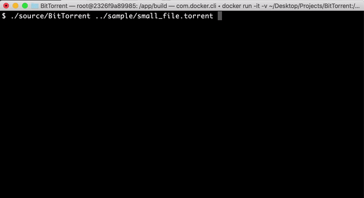

# BitTorrent

BitTorrent is a small torrenting client written from scratch in C++. The only external library used is OpenSSL for computing SHA1 hashes. Tested only on Ubuntu 18.04 plateform (Dockerfile provided). In particular, it used Linux specific features (eg. epoll).

## How does it work

* First, parse the torrent file which is "bencoded". The torrent file contains relevant
information like the tracker URL (UDP or TCP/HTTP), the file name, file size, the piece length etc...
* Request the peer list from the tracker. If all goes well, the tracker will respond with
a list of (ip,port) pairs.
* Start downloading the file by sending messages over TCP. First do the BitTorrent "handshake", then
listen to the "have" and "bitfield" messages to know what pieces each peer has. Once you receive
an "unchoke" message, start requesting piece blocks.
* To determine which piece is to be requested next by a connection, I used a priority queue that keeps the least requested pieces on top. When I pop, I check whether the piece has been received.
* In order to read from multiple TCP sockets at the same time in one single thread, I used the epoll facility (Linux kernel 2.5.44 and above).
* A worker thread buffers the received data and flushes it to the disk from time to time.
* The current download speed is calculated in a separate worker thread using an exponential decay formula.

## Demo


## Build & Run

Run the following commands:

```
mkdir build
cd build
cmake ..
make BitTorrent
./source/BitTorrent <torrent_file>
```

## Testing

Run the following commands:

```
git clone https://github.com/google/googletest.git
mkdir build
cd build
cmake ..
make
```

After having built the project, the test binaries are located
in build/test/

